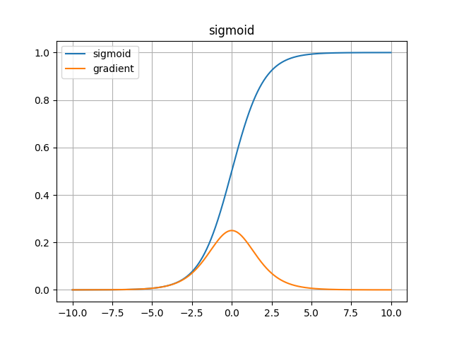
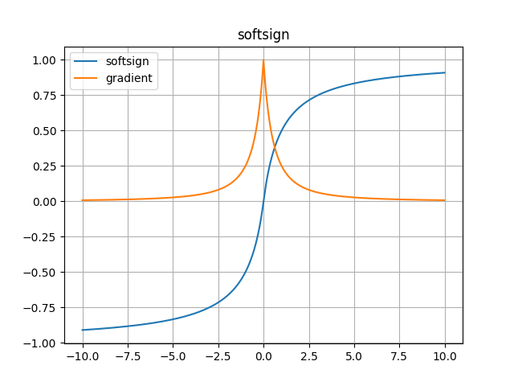
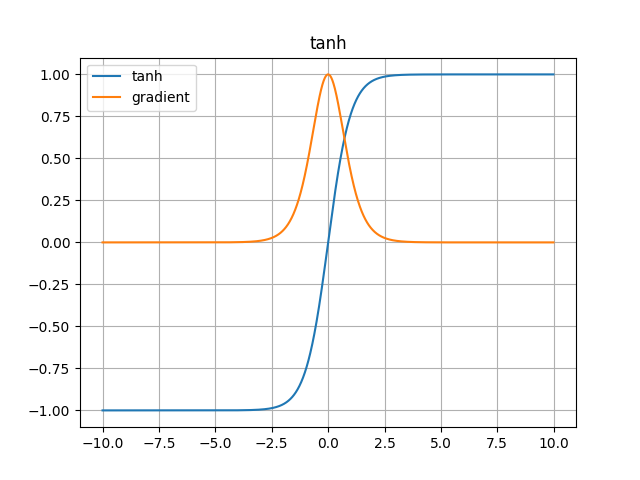
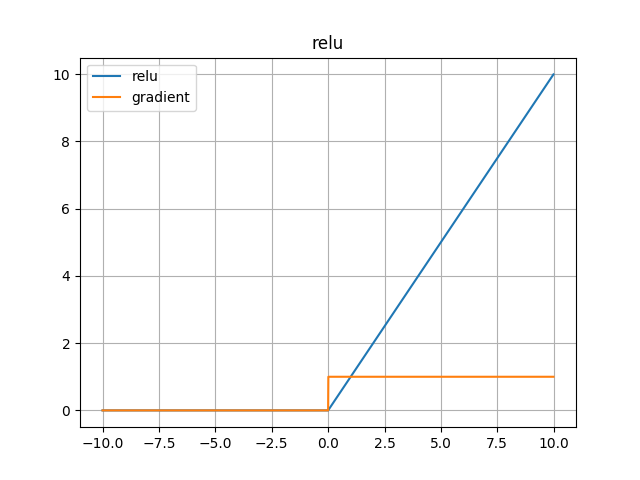
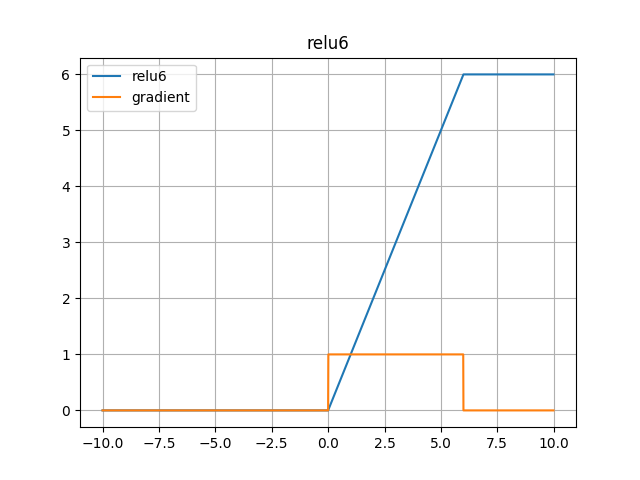
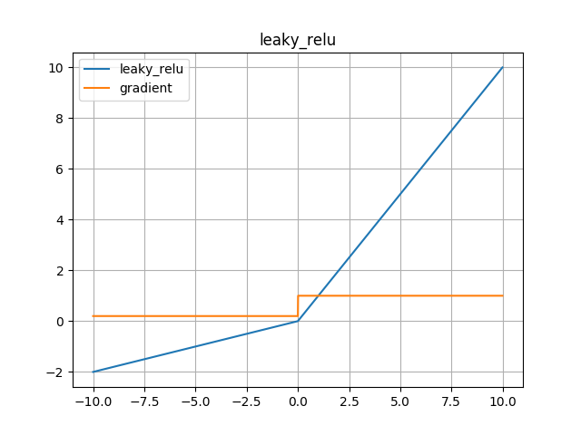
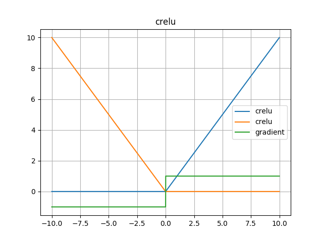
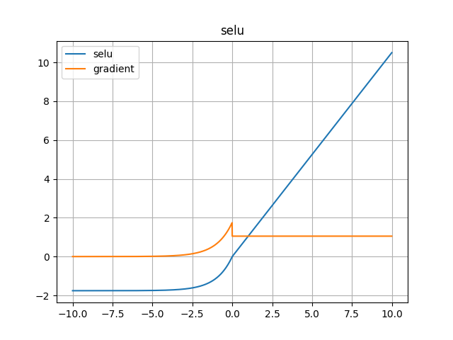
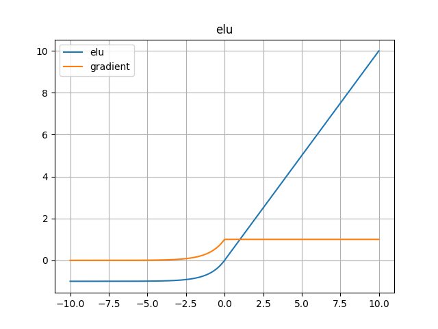
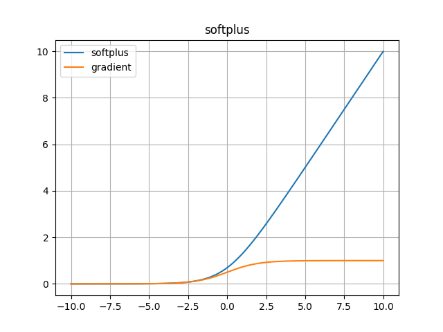

# intro-ml-python
Playground project for learning purposes


# setup

## first time
```bash
conda create --name tf pip python=3.6 #create virtual environment
source activate tf  # enter created environment
pip install -r requirements.txt # inside environment install tensorflow and all dependencies

```

## next time

```bash
source activate tf  # enter created environment
```

## occasionally 

```bash
pip install --upgrade tensorflow
pip freeze > requirements.txt 
pip install -r requirements.txt 
```
## tensor board
```bash
tensorboard --logdir func_approx/.tensorboard-func_approx.py
```


## Setup Intellij
Find the environment path:
```bash
conda info --envs | grep tf
```
Open project settings and add python SDK pointing to proper virtual environment found above:


## Activation functions






















